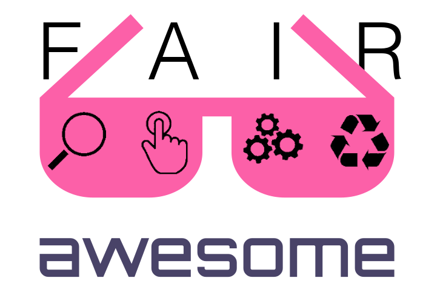

	
	 
	 
	 

# Awesome FAIR Data

 

> A by the [Helmholtz metadata collaboration (HMC)](https://helmholtz-metadaten.de/en) curated list of awesome stuff around the FAIR principles for (scientific) data, i.e that data is findable, accessable, interoperable and re-usable. The list is organized in use cases of data producers, data users, data curators and data provides. 'FAIR' is not the same as 'open', but there is overlap.

## Contents
* [Resources about the FAIR principles](#resources-about-the-fair-principles)
    * [FAIR Digital Object and related projects](#fair-digital-object-and-related-projects)
* [FAIR assessment](#fair-assessment)
* [Organizations and Communities](#organizations-and-communities)
* [Metadata formats and standards](#metadata-formats-and-standards)
* [Ontology services](#ontology-services)
	* [Related semantics lists](#related-semantics-lists)
* [Finding datasets and software](#finding-datasets-and-software)
* [Software publications](#software-publications)
* [Provenance tracking](#provenance-tracking)
	* [Related workflow tools lists](#related-workflow-tools-lists)
* [Metadata management](#metadata-management)
* [Your own repository setup](#your-own-repository-setup)
* [Awesome meta data sources](#awesome-meta-data-sources)
* [Related lists](#related-lists)
## Resources about the FAIR principles

* [Barend Mons article in Nature 578, 491 (2020)](https://doi.org/10.1038/d41586-020-00505-7) - Proposition to invest 5% of research funds in ensuring data are reusable.

* [Cost of not having FAIR research data](https://op.europa.eu/s/sV6Z) - A 2018 European Commission Cost-benefit analysis for FAIR research data (Written by PwC EU Services).

* [The FAIR Guiding Principles for scientific data management and stewardship](https://doi.org/10.1038/sdata.2016.18) - This Comment in [Sci Data](https://www.nature.com/sdata/) is the first formal publication of the FAIR Principles (2016).

* [GO FAIR Zotero Library](https://www.zotero.org/groups/2345721/fair_data_resources/) - Nice collection of publications around the FAIR principles.

### FAIR Digital Object and related projects

* [DataPLANT ARC Tool Talk](https://www.youtube.com/watch?v=dOMNzY5rUlE&t=2137s) - NFDI4plants interpretation of the FDO based on GitHub repository and RO Crate.

* [DONA Suggested Reading](https://www.dona.net/suggested-reading-documents) - The history of the Digital Object Architecture (DOA) back into the 80s.

* [FAIR Digital Objects Forum](https://fairdo.org/) - General platform for discussions on the advancement and development of FAIR Digital Objects.

* [FAIR Digital Object Framework](https://fairdigitalobjectframework.org/) - A WIP specification for an FDO infrastructure based on linked data / RDF.

* [FAIR DO publications](https://www.rd-alliance.org/group/data-fabric-ig/wiki/fair-do-publications) - Relevant publications (concept papers and specs) by RDA working groups on FDOs.

* [RO Crate](https://www.researchobject.org/ro-crate/) - Pragmatic approach combining existing technologies and ontologies into a metadata standard for annotating scientific. datasets.

* [PID services registry](https://pidservices.org/) - A searchable registry for PID services
## FAIR assessment

* [FAIR Evaluation Services](https://fairsharing.github.io/FAIR-Evaluator-FrontEnd/#!/) - A FAIR assessment tool from FAIRsharing, [code](https://github.com/FAIRMetrics/Metrics).

* [F-uji](https://www.f-uji.net/) - An (online) tool which can provide a FAIR score for a given PID based on a metric created by FAIRsFAIR, [code](https://github.com/pangaea-data-publisher/fuji).

## Organizations and Communities

* [EuDat](https://www.eudat.eu/) - Collaborative European data infrastructure.

* [FAIRsharing](https://fairsharing.org/) - A curated resource on data and metadata standards, inter-related to databases and data policies. 

* [Research Data Alliance](https://www.rd-alliance.org/) - International organization and communication platform for establishing standards and recommendations concerning research data publication.

* [The Turing Way](https://the-turing-way.netlify.app/welcome.html) - Handbook and community for reproducible, ethical and collaborative data science.

## Metadata formats and standards

* [Data Catalog (DCAT)](https://www.w3.org/TR/vocab-dcat-2/) - RDF vocabulary designed to facilitate interoperability between data catalogs published on the Web.

* [Dublin Core Metadata Initiative Terms](https://www.dublincore.org/specifications/dublin-core/dcmi-terms/) - Dublin Core Metadata Element Set, is a set of fifteen "core" elements for describing resources.

* [JSON LD Playground](https://json-ld.org/playground/) - Convert JSON-LD data between various representations.

* [JSON Schema](https://json-schema.org/) - Standard for the description of structural constraints in order to do validation of JSON objects.

* [Provenance Primer (PROV)](https://www.w3.org/TR/2013/NOTE-prov-primer-20130430/) - This primer document provides an accessible introduction to the PROV data model for provenance interchange on the Web.

* [Resource Description Framework (RDF)](https://www.w3.org/RDF/) - RDF is a standard model for data interchange on the Web. 

* [Schema.org](https://schema.org/) - Well-established and industry-accepted vocabulary providing semantics for common entities like Person, Organization, Dataset, etc.

* [SKOS](https://www.w3.org/2009/08/skos-reference/skos.html) - The Simple Knowledge Organization System (SKOS) is a common data model for sharing and linking knowledge organization systems via the Semantic Web.

## Ontology services

* [Ontobee](http://www.ontobee.org/) - A linked ontology data server to support ontology term dereferencing, linkage, query and integration. 
See also this [publication](https://academic.oup.com/nar/article/45/D1/D347/2770665).

* [Ontology Lookup Service](https://www.ebi.ac.uk/ols/index) - OLS is a repository for biomedical ontologies that aims to provide a single point of access to the latest ontology versions.
### Related semantics lists
Also see 
* [awesome-ontology](https://github.com/ozekik/awesome-ontology) - A curated list of ontology things.
* [awesome-semantic-tools](https://github.com/costezki/awesome-semantic-tools) - List of projects related to Ontology engineering and Semantic Web technologies.
## Finding datasets and software

* [Datacite commons](https://commons.datacite.org/) - Search through the metadata indexed by Datacite.

* [EuDat B2find](http://b2find.eudat.eu/) - Search through metadata of datasets accumulated by EuDat.

* [Microsoft academy](https://academic.microsoft.com/home) - Mircosoft academy search through a pid graph created by microsoft (shutdown end of 2021).

* [OpenAIRE explorer](https://explore.openaire.eu/) - Search through the metadata indexed by openaire.

* [Research Software Repository](https://research-software.nl/) - Aggregates research software from various sources with information about the problem it solves and its scientific domain.

## Software publications

* [CITATION.CFF](https://citation-file-format.github.io/) - Plain text files with human- and machine-readable citation information for software (and datasets). Supported by GitHub, Zenodo, Zotero.

* [Citable code with Zenodo & GitHub](https://guides.github.com/activities/citable-code/) - Make GitHub repositories citable with Zenodo DOI.

* [CodeMeta](https://codemeta.github.io/) - CodeMeta works on providing a minimal metadata schema for science software and code, in JSON and XML to create a concept vocabulary that can be used to standardize the exchange of software metadata across repositories and organizations. 

* [fossology](https://github.com/fossology/fossology) - FOSSology is an open source license compliance software system and toolkit. You can run license, copyright and export control scans from the command line.

* [SOMEF](https://github.com/KnowledgeCaptureAndDiscovery/somef) - Extract software publication metadata from README and other docs automatically using ML and other techniques to reduce the amount of boilerplate work for the developer.

## Provenance tracking

* [AiiDA](https://www.aiida.net/) - Automated Interactive Infrastructure and Database for Computational Science (AiiDA) to automatically track provenance of simulation workflows and all associated data, [code](https://github.com/aiidateam/aiida-core).

* [DataLad](https://www.datalad.org/) - A free and open-source distributed data management system for everyone. It is based on git-annex with manual to automatic provenance tracking, [code](https://github.com/datalad/datalad).

* [MLflow](https://mlflow.org/) - Tool to track the provenance of machine learning applications, [code](https://github.com/mlflow/mlflow/).

* [CWL](https://www.commonwl.org) - Domain-agnostic and community-driven open standard for description and execution of research workflows that supports provenance tracking ([CWLProv](https://github.com/common-workflow-language/cwltool/blob/main/CWLProv.rst)) in a standard-compliant way using the existing RO Crate, PROV and BagIt standards.
### Related workflow tools lists
There is overlap with these more general lists of workflow tools, but not every pipeline or workflow manager includes good provenance tracking.
* [awesome-pipeline](https://github.com/pditommaso/awesome-pipeline) - A curated list of awesome pipeline toolkits inspired by Awesome Sysadmin.
* [Awesome workflow engines](https://github.com/meirwah/awesome-workflow-engines) - Curated list of awesome open source workflow engines.
* [Computational Data Analysis Workflow Systems](https://github.com/common-workflow-language/common-workflow-language/wiki/Existing-Workflow-systems) - A list of existing workflow systems.

## Metadata management
## Your own repository setup

* [Dataverse](https://dataverse.org/) - Open source research data repository software [code](https://github.com/IQSS/dataverse).

* [EuDat B2share](https://b2share.eudat.eu/) - A repository by EuDat, but the software is open sourc, bases in invenio and one can setup own instances of it, [code](https://github.com/EUDAT-B2SHARE/b2share).

* [Invenio](https://invenio-software.org/) - Open source customizable software to setup large scale digital repositories, library systems and data repositories, [code](https://github.com/inveniosoftware/invenio).

* [InvenioRDM](https://inveniosoftware.org/products/rdm/) - The turn-key research data management repository based on Invenio framework and Zenodo.

## Awesome meta data sources

* [Microsoft academy graph](https://doi.org/10.5281/zenodo.2628216) - All the data and links from Mircosoft academy (shutdown end of 2021).

* [Openaire graph](https://doi.org/10.5281/zenodo.4707307) - All metadata contained in the openaire graph.

## Related lists
Awesome lists related to several points.

* [Awesome-open-climate-science](https://github.com/pangeo-data/awesome-open-climate-science) - An open science related list specific to the domain of Atmospheric, Ocean, and Climate science.
* [Awesome-open-science-software](https://github.com/INRIA/awesome-open-science-software) - A list of open science resources and software.
* [Awesome Curated Tools](https://github.com/chow-petit/awesome-curated-tools) - A curated list of digital tools we use, ranging from accounting and data science to scientific research and liquid democracy.

## Contributing
Contributions are welcome! :sunglasses:  
If you want to contribute please read the <a href=https://github.com/Materials-Data-Science-and-Informatics/awesome-fair-data/blob/main/CONTRIBUTING.md>contribution guideline</a>.

